

# טאלה — מטבח תאילנדי 🇹🇭
# Tala Thai Kitchen

מחירים בש"ח (₪). המנות מותאמות לתפריט הרשמי של המסעדה.

---

## ראשונות / Starters

### סלט פאפאיה · Papaya Salad (Som Tum) — 54 ₪ 🌶️
פאפאיה ירוקה, גזר, עגבניות שרי, שום וצ'ילי ברוטב תאילנדי מסורתי. לבחירה: חריף / חריף מאוד.

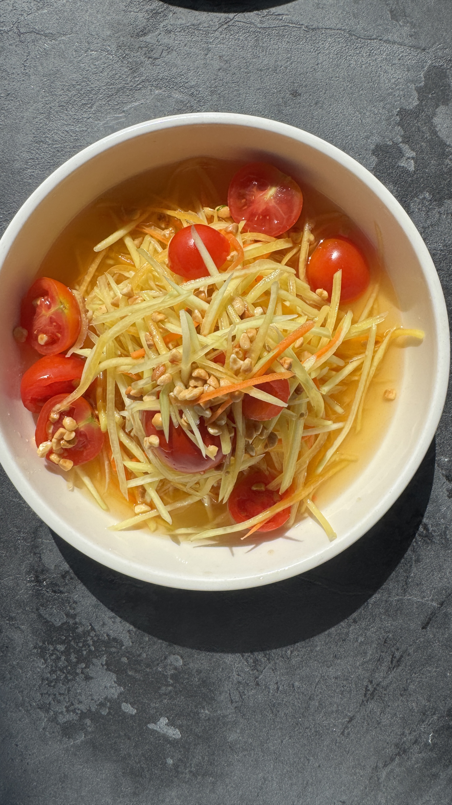

### סלט פומלה / מנגו בעונה ודג מטוגן · Pomelo / Mango Salad with Fried Fish — 68 ₪
פומלה טרייה או מנגו בעונה, עשבי תיבול, בצל סגול, קשיו ודג בטמפורה.

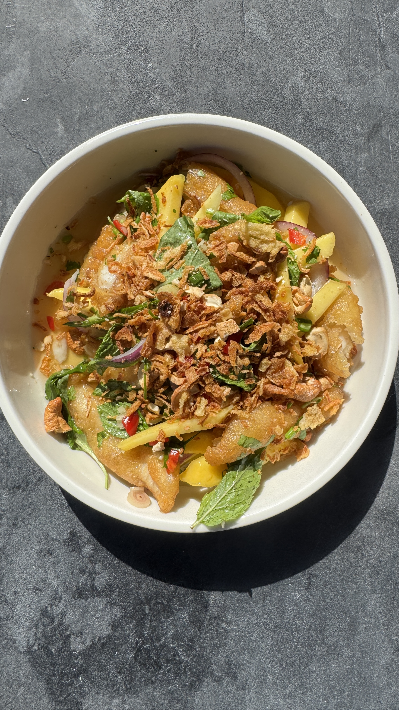

### נאם טוק בקר · Nam Tok Beef Salad — 74 ₪ 🌶️
פרוסות שייטל צרובות, עשבי תיבול, בצל סגול, צ'ילי קלוי, ליים וסויה. מוגש בליווי סטיקי רייס.

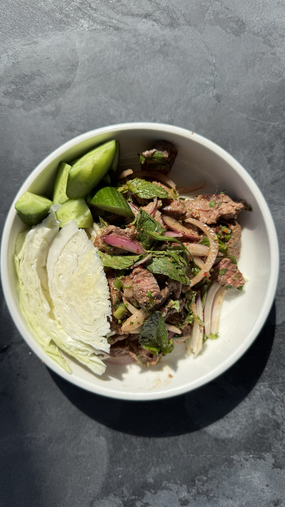

### אגרול תאילנדי · Thai Spring Rolls — 46 ₪
רול פריך במילוי כרוב, גזר, סלרי, נבטים ואטריות זכוכית. בליווי רוטב חמוץ-מתוק.

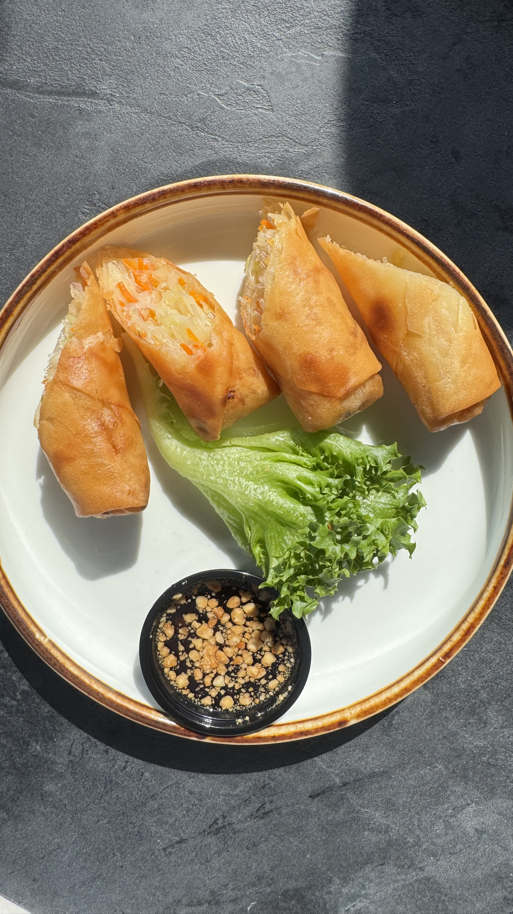

### מיאנג קאם סלמון נא · Miang Kham Raw Salmon — 58 ₪
סלמון נא עם בצל ירוק, בצל אדום, אטריות שעועית, עשבי תיבול וליים. בליווי רוטב בוטנים, על מצע חסה אייסברג.

_אין תמונה זמינה._

### סלט אטריות שעועית · Glass Noodle Salad (Yum Woon Sen) — 62 ₪ 🌶️
אטריות שעועית, עלי סלרי, נענע, בצל סגול, עגבנייה, גזר ומלפפון, רוטב חריף-חמוץ-מתוק.

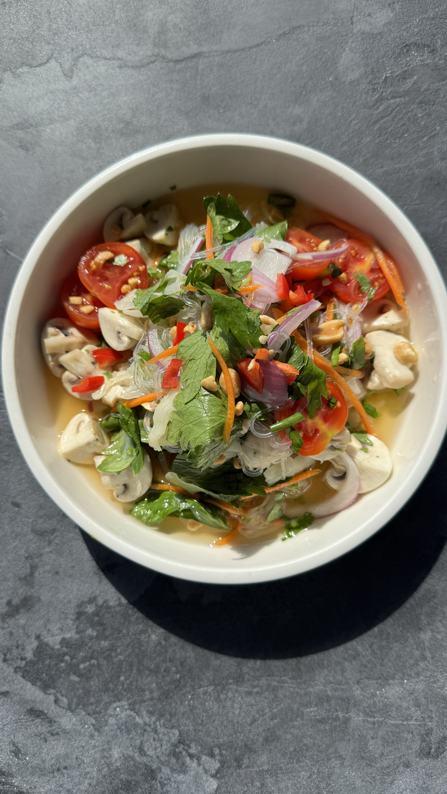

### צ'יקן סאטה · Chicken Satay — 58 ₪
ארבעה שיפודי פרגית על מצע עלי חסה, בליווי רוטב בוטנים ובצל מוחמץ בצד.

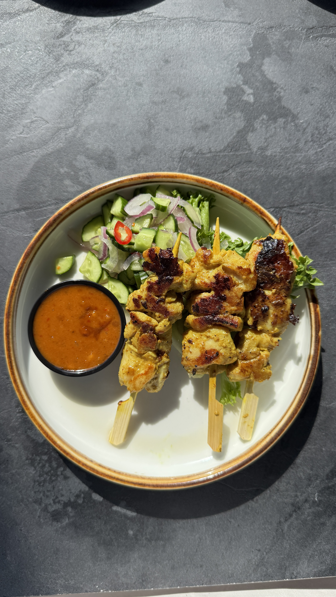

---

## עיקריות / Mains

> תוספת חלבון לבחירה: עוף 15 ₪ / בקר 18 ₪ / טופו 18 ₪.

### פאד תאי · Pad Thai — 68 ₪
אטריות אורז מוקפצות עם ביצה, גזר, כרוב לבן, נבטים, בצל ירוק, בוטנים, צ'ילי יבש גרוס וליים. קיימת אופציה ללא גלוטן.

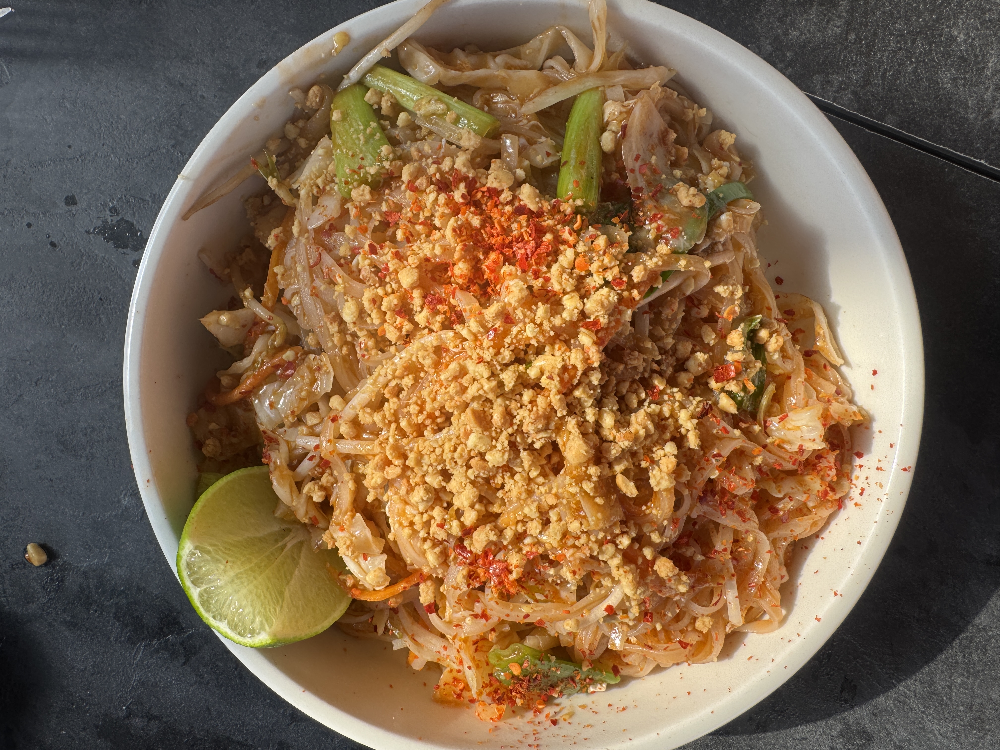

### פאד קפאו · Pad Krapow — 84 ₪ 🌶️
בשר טחון מוקפץ עם בזיליקום תאילנדי, בצל סגול, שעועית ירוקה, שום וצ'ילי. בליווי אורז יסמין וביצת עין.

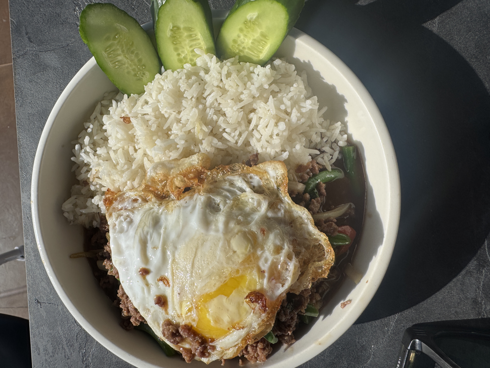

### מוקפץ קשיו · Cashew Stir-Fry — 78 ₪
פלפלים צבעוניים, בצל לבן, בצל ירוק, שום וקשיו קלוי, ברוטב חמוץ-מתוק.

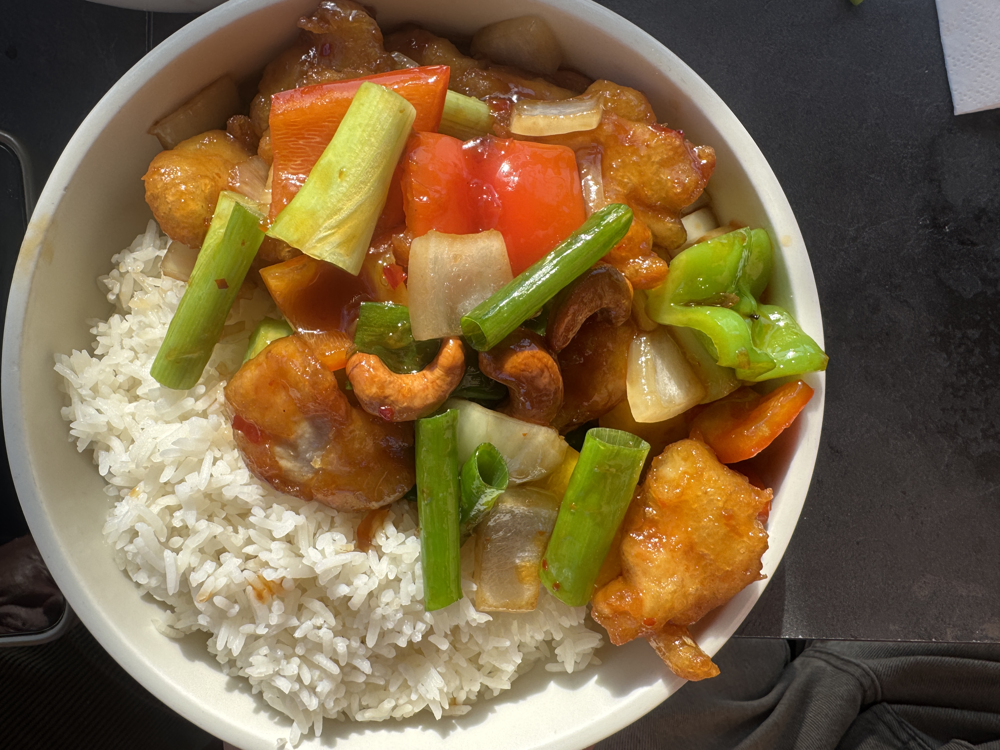

### קארי ירוק · Green Curry — 74 ₪ 🌶️
חלב קוקוס, חציל תאילנדי, בזיליקום ועשבי תיבול.

_אין תמונה זמינה._

### קארי אדום · Red Curry — 74 ₪ 🌶️
קארי תאילנדי אדום, חלב קוקוס, ירקות טריים.

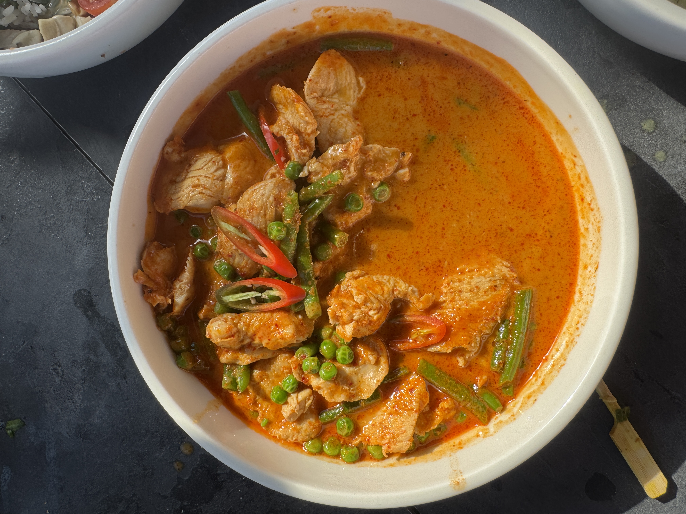

### קאו פאד · Khao Pad (Thai Fried Rice) — 66 ₪
אורז מוקפץ בסגנון תאילנדי, ירקות, ביצה ובצל ירוק.

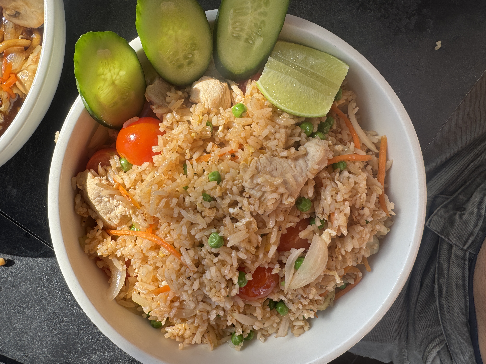

### אטריות ביצים מוקפצות · Stir-Fried Egg Noodles — 68 ₪
אטריות ביצים מוקפצות עם כרוב, גזר, פטריות ובצל ירוק ברוטב סויה מתקתק.

_אין תמונה זמינה._

### מרק טום יאם · Tom Yam Soup — 62 ₪ 🌶️
מרק תאילנדי חריף-חמצמץ, למון גראס, פטריות, ליים וצ'ילי.

_אין תמונה זמינה._

---

_מקור: תפריט Tala Thai Kitchen (עמודים 1–2 מתוך 3). עמוד 3 לא סופק._

